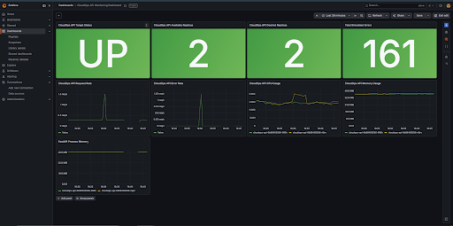
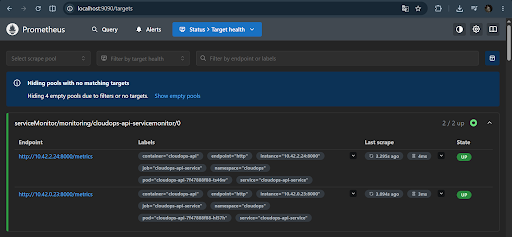
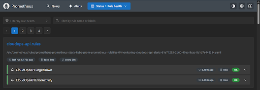
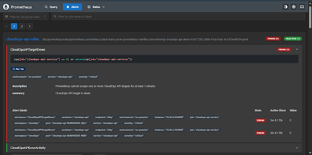
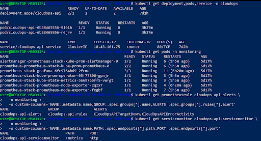

# On-Premise Cloud-Native CI/CD and Monitoring Platform

A self-hosted DevOps and SRE portfolio project built on a Windows 10 laptop using Ubuntu WSL2.

This project demonstrates how a Python application can be containerized, deployed to Kubernetes, provisioned with Infrastructure as Code, tested and deployed through a CI/CD pipeline, monitored with Prometheus and Grafana, and validated using Bash and Ansible automation.

The entire platform runs locally without requiring paid cloud infrastructure.

---

## Project Overview

The platform runs a Python FastAPI application called **CloudOps Status API**.

The application is:

* Containerized using Docker
* Executed as a non-root user
* Deployed to a local k3d Kubernetes cluster
* Provisioned using Terraform
* Tested automatically using Pytest
* Built and deployed using Jenkins
* Monitored using Prometheus and Grafana
* Protected with Kubernetes resource limits and security contexts
* Evaluated using Prometheus alert rules
* Validated using Bash and Ansible automation

---

## Architecture

```text
Windows 10
└── Ubuntu WSL2
    ├── Docker Desktop
    │   └── k3d Kubernetes Cluster
    │       ├── CloudOps FastAPI Application
    │       │   ├── 2 Kubernetes replicas
    │       │   ├── ClusterIP Service
    │       │   ├── Readiness and liveness probes
    │       │   └── Non-root hardened containers
    │       └── Monitoring Namespace
    │           ├── Prometheus
    │           ├── Grafana
    │           ├── Alertmanager
    │           ├── kube-state-metrics
    │           └── Prometheus Operator
    ├── Jenkins CI/CD
    ├── Terraform
    ├── Helm
    ├── Bash Automation
    └── Ansible
```

### Platform Workflow

```text
Source Code
    ↓
Jenkins Checkout
    ↓
Docker Image Build
    ↓
Pytest Automated Testing
    ↓
Import Image into k3d
    ↓
Kubernetes Rolling Deployment
    ↓
Application Health Check
    ↓
Prometheus Metrics Collection
    ↓
Grafana Dashboard and Prometheus Alerts
```

---

## Technology Stack

| Area                    | Technology                             |
| ----------------------- | -------------------------------------- |
| Application             | Python, FastAPI, Uvicorn               |
| Automated Testing       | Pytest, FastAPI TestClient             |
| Containerization        | Docker                                 |
| Container Orchestration | Kubernetes with k3d/k3s                |
| Infrastructure as Code  | Terraform                              |
| CI/CD                   | Jenkins                                |
| Monitoring              | Prometheus                             |
| Dashboard               | Grafana                                |
| Alerting                | PrometheusRule and Alertmanager        |
| Kubernetes Monitoring   | Prometheus Operator and ServiceMonitor |
| Package Manager         | Helm                                   |
| Automation              | Bash and Ansible                       |
| Operating Environment   | Windows 10 and Ubuntu WSL2             |

---

## Application Endpoints

| Endpoint          | Purpose                                     |
| ----------------- | ------------------------------------------- |
| `/`               | Returns basic application information       |
| `/health`         | Returns application health and timestamp    |
| `/metrics`        | Exposes Prometheus metrics                  |
| `/simulate-load`  | Generates CPU activity for monitoring tests |
| `/simulate-error` | Generates a simulated HTTP 500 error        |

The application exposes the following custom Prometheus metrics:

```text
cloudops_request_total
cloudops_error_total
```

---

## Repository Structure

```text
.
├── app/
│   ├── Dockerfile
│   ├── main.py
│   ├── requirements.txt
│   └── requirements-dev.txt
├── ansible/
│   ├── inventory.ini
│   └── setup-local.yml
├── docs/
│   └── progress.md
├── kubernetes/
│   ├── deployment.yaml
│   ├── namespace.yaml
│   └── service.yaml
├── monitoring/
│   ├── cloudops-prometheusrule.yaml
│   ├── cloudops-servicemonitor.yaml
│   └── grafana-dashboard.json
├── screenshots/
│   └── phase-4-monitoring-alerting/
├── scripts/
│   ├── check-monitoring.sh
│   ├── generate-traffic.sh
│   ├── health-check.sh
│   ├── open-grafana.sh
│   ├── open-prometheus.sh
│   └── start-cluster.sh
├── terraform/
│   ├── main.tf
│   ├── outputs.tf
│   ├── provider.tf
│   └── variables.tf
├── tests/
│   └── test_main.py
├── Jenkinsfile
└── README.md
```

---

## Application Testing

The project includes five automated Pytest tests covering:

* Root endpoint
* Health endpoint
* Prometheus metrics endpoint
* Load simulation endpoint
* Error simulation endpoint and HTTP 500 response

Run the tests locally from the repository root:

```bash
python3 -m venv .venv
source .venv/bin/activate

pip install -r app/requirements.txt
pip install -r app/requirements-dev.txt

python -m pytest -v
```

Expected result:

```text
5 passed
```

The Jenkins pipeline also runs the same automated tests before the application is deployed.

---

## Container Security

The Docker image uses a dedicated non-root user:

```text
UID: 10001
GID: 10001
```

The runtime image is configured with:

```dockerfile
USER 10001:10001
```

Verify the container user:

```bash
docker run --rm cloudops-status-api:local id
```

Expected result:

```text
uid=10001(appuser) gid=10001(appgroup)
```

---

## Kubernetes Deployment

The application runs in the `cloudops` namespace with two replicas.

```bash
kubectl get deployment,pods,service -n cloudops
```

The deployment includes:

* Two application replicas
* Readiness probe
* Liveness probe
* CPU and memory requests
* CPU and memory limits
* Non-root execution
* Read-only root filesystem
* Disabled privilege escalation
* All Linux capabilities dropped

### Resource Configuration

| Resource | Request |   Limit |
| -------- | ------: | ------: |
| CPU      |   `50m` |  `250m` |
| Memory   |  `64Mi` | `256Mi` |

### Security Context

```yaml
runAsNonRoot: true
runAsUser: 10001
runAsGroup: 10001
allowPrivilegeEscalation: false
readOnlyRootFilesystem: true
capabilities:
  drop:
    - ALL
```

---

## Infrastructure as Code

Terraform manages the following Kubernetes resources:

* `cloudops` namespace
* CloudOps API Deployment
* CloudOps API Service
* Resource requests and limits
* Container security context
* Readiness and liveness probes

Initialize and inspect the Terraform configuration:

```bash
cd terraform

terraform init
terraform validate
terraform plan
```

Apply the infrastructure:

```bash
terraform apply
```

Verify the Terraform-managed resources:

```bash
terraform state list
terraform output
```

Terraform ignores changes to the deployed container image because Jenkins is responsible for updating application image versions.

This separation prevents Terraform from reverting the image deployed by the CI/CD pipeline.

---

## Jenkins CI/CD Pipeline

The Jenkins pipeline contains the following stages:

1. **Checkout**
2. **Verify Tools**
3. **Build Docker Image**
4. **Test Application**
5. **Import Image to k3d**
6. **Deploy to Kubernetes**
7. **Health Check**

Each Jenkins build creates an image using the following pattern:

```text
cloudops-status-api:jenkins-${BUILD_NUMBER}
```

The pipeline performs the following workflow:

* Clones the GitHub repository
* Verifies Docker, kubectl, k3d, and Kubernetes connectivity
* Builds the Docker image
* Verifies that the container runs as UID `10001`
* Runs five Pytest tests
* Imports the image into the k3d cluster
* Updates the Kubernetes Deployment
* Waits for the rollout to complete
* Verifies the deployed application through `/health`
* Cleans unused Docker image layers

Verify the currently deployed image:

```bash
kubectl get deployment cloudops-api \
  -n cloudops \
  -o jsonpath='{.spec.template.spec.containers[0].image}{"\n"}'
```

---

## Monitoring

The monitoring stack is installed using the Helm `kube-prometheus-stack` chart in the `monitoring` namespace.

The stack includes:

* Prometheus
* Grafana
* Alertmanager
* Prometheus Operator
* kube-state-metrics
* Node Exporter

A Kubernetes `ServiceMonitor` collects application metrics from:

```text
/metrics
```

Scrape interval:

```text
15 seconds
```

Verify the ServiceMonitor:

```bash
kubectl get servicemonitor cloudops-api-servicemonitor \
  -n monitoring
```

---

## Grafana Dashboard

The exported dashboard is stored at:

```text
monitoring/grafana-dashboard.json
```

The dashboard includes:

* CloudOps API Target Status
* Available Replicas
* Desired Replicas
* CloudOps API Request Rate
* CloudOps API Error Rate
* Total Simulated Errors
* Container CPU Usage
* Container Memory Usage
* FastAPI Process Memory

Main PromQL queries:

```promql
sum(rate(cloudops_request_total[1m]))
```

```promql
sum(rate(cloudops_error_total[1m]))
```

```promql
sum(cloudops_error_total)
```

### Grafana Dashboard Evidence



---

## Prometheus Alerting

The project includes two application alert rules.

### CloudOpsAPITargetDown

Triggers when Prometheus cannot scrape one or more CloudOps API targets for at least one minute.

```promql
(up{job="cloudops-api-service"} == 0)
or
absent(up{job="cloudops-api-service"})
```

Severity:

```text
critical
```

### CloudOpsAPIErrorActivity

Triggers when the application error counter increases during the previous two minutes.

```promql
sum(increase(cloudops_error_total[2m])) > 0
```

Severity:

```text
warning
```

Apply the alert rules:

```bash
kubectl apply -f monitoring/cloudops-prometheusrule.yaml
```

Verify the rules:

```bash
kubectl get prometheusrule cloudops-api-alerts \
  -n monitoring
```

### Prometheus Evidence

#### Application targets



#### Loaded alert rules



#### Target-down alert test



#### Kubernetes monitoring verification



---

## Local Automation

### Bash Scripts

Start or verify the cluster:

```bash
./scripts/start-cluster.sh
```

Check application health:

```bash
./scripts/health-check.sh
```

Check monitoring resources:

```bash
./scripts/check-monitoring.sh
```

Open Prometheus:

```bash
./scripts/open-prometheus.sh
```

Open Grafana:

```bash
./scripts/open-grafana.sh
```

Generate application traffic:

```bash
./scripts/generate-traffic.sh
```

### Ansible Validation

Run the Ansible environment validation:

```bash
ansible-playbook \
  -i ansible/inventory.ini \
  ansible/setup-local.yml
```

The playbook validates:

* Docker
* kubectl
* k3d
* Helm
* Terraform
* Kubernetes nodes
* Application Pods
* Monitoring Pods

---

## Setup Guide

For complete instructions to build the platform from a fresh Git clone, see:

[Fresh Clone Setup Guide](docs/setup-guide.md)

---

## Current Project Status

Completed components:

* FastAPI application
* Five automated Pytest tests
* Docker containerization
* Non-root Docker runtime
* k3d Kubernetes cluster
* Two application replicas
* Kubernetes health probes
* Resource requests and limits
* Hardened Kubernetes security context
* Terraform Infrastructure as Code
* Jenkins CI/CD pipeline
* Automated testing before deployment
* Prometheus custom metrics
* Prometheus ServiceMonitor
* Grafana monitoring dashboard
* Prometheus alert rules
* Bash automation
* Ansible environment validation
* Monitoring and alerting evidence

---

## Key Learning Outcomes

This project provided hands-on experience with:

* Building and containerizing a Python API
* Running containers securely as a non-root user
* Deploying applications to Kubernetes
* Managing Kubernetes resources using Terraform
* Designing a Jenkins CI/CD pipeline
* Running automated tests before deployment
* Applying Kubernetes resource and security controls
* Collecting application and infrastructure metrics
* Creating Grafana dashboards
* Writing and testing Prometheus alert rules
* Automating local infrastructure validation

---

## Project Scope

This project is designed as a local on-premise DevOps and SRE learning environment.

It demonstrates production-oriented practices on a single development laptop, but it is not presented as a production-ready multi-node enterprise platform.

---

## Author

**Nabil Raditya Maulana Sakti**

Applied Internet Engineering graduate with interests in Cloud Infrastructure, DevOps, Site Reliability Engineering, Kubernetes, automation, and observability.

